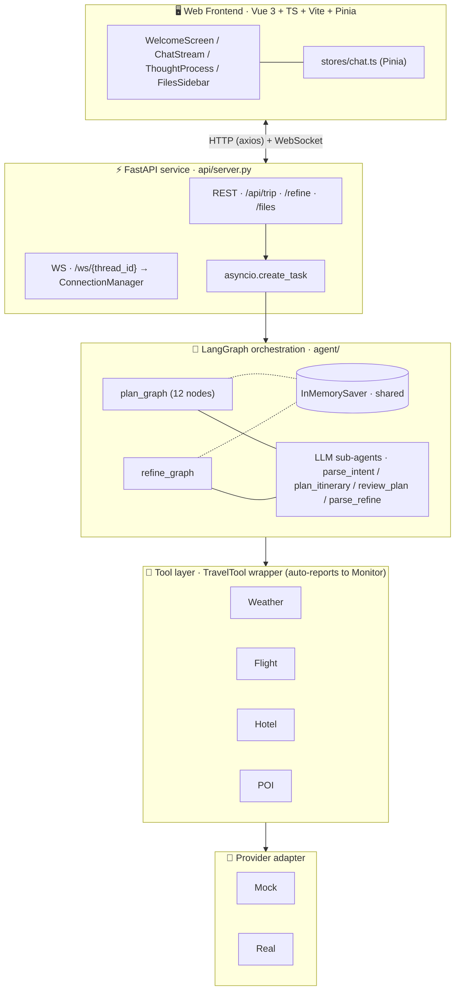
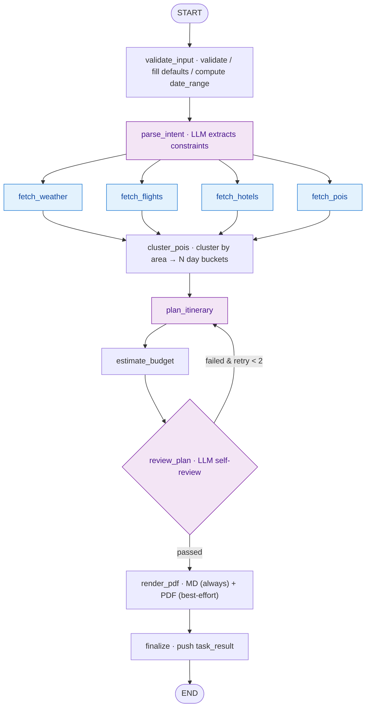
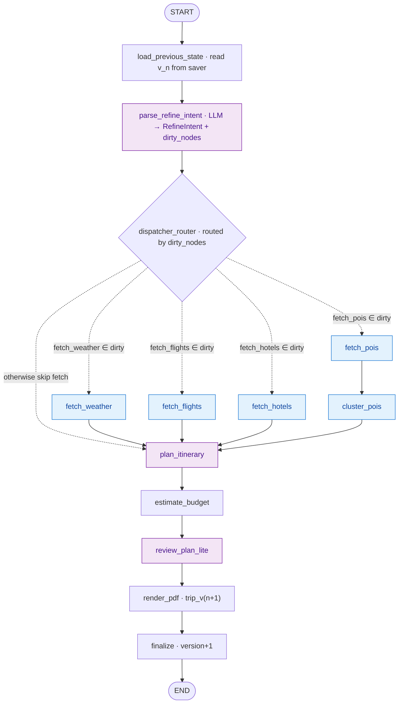
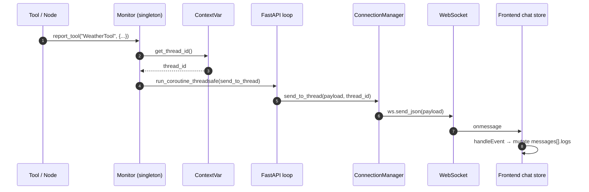
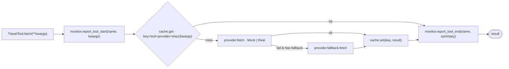
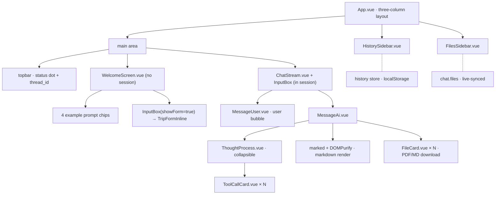
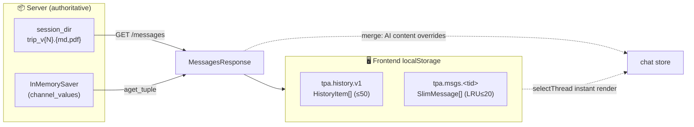
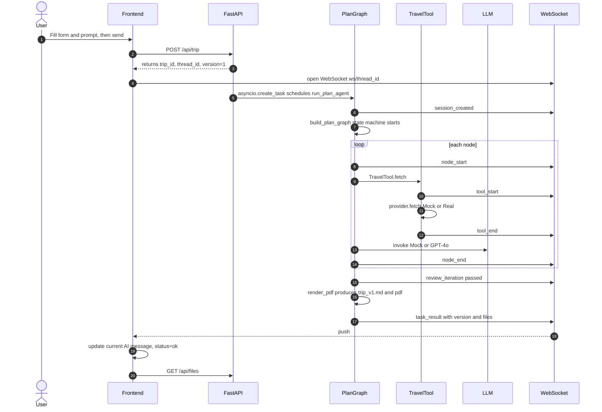
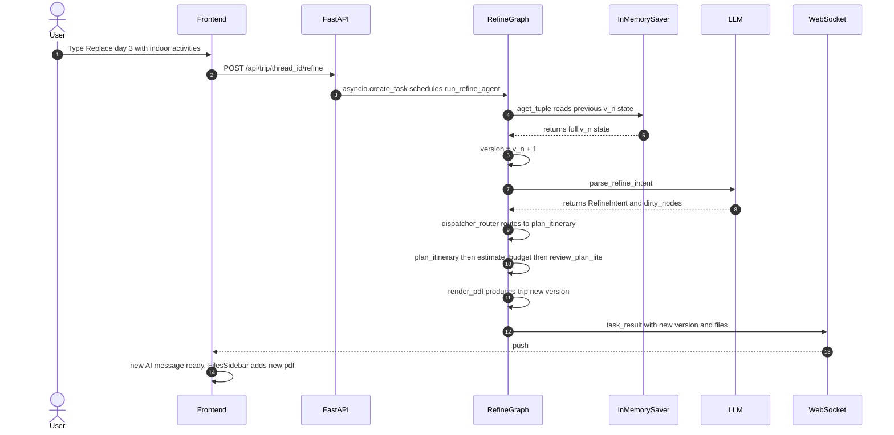

<div align="center">

# ✈️ TravelPlanningAgent

### A multi-agent travel planner powered by LangGraph

Submit your trip in one sentence or a single form. The agent runs **multi-source data aggregation + itinerary orchestration + self-review + Markdown / PDF report generation**,<br/>
streaming **graph nodes / tool calls / chain-of-thought** over WebSocket in real time, with full **multi-turn refinement** and **zero-key MOCK mode**.

[](https://www.python.org/)
[](https://fastapi.tiangolo.com/)
[](https://langchain-ai.github.io/langgraph/)
[](https://vuejs.org/)
[](./LICENSE)

**English** · [简体中文](./README.md)

</div>

<p align="center">
  
  
</p>

---

## Table of Contents

- [Highlights](#highlights)
- [Architecture Overview](#architecture-overview)
- [Tech Stack](#tech-stack)
- [Project Layout](#project-layout)
- [Backend Deep Dive](#backend-deep-dive)
  - [LangGraph Workflows](#langgraph-workflows)
  - [TripState Design](#tripstate-design)
  - [Cross-coroutine Event Push (ContextVar + Monitor)](#cross-coroutine-event-push-contextvar--monitor)
  - [Checkpointer & Multi-turn Refinement](#checkpointer--multi-turn-refinement)
  - [LLM Abstraction](#llm-abstraction)
  - [Tool Layer (Mock/Real Switching)](#tool-layer-mockreal-switching)
  - [PDF Renderer (Multi-engine)](#pdf-renderer-multi-engine)
- [Frontend Deep Dive](#frontend-deep-dive)
  - [Component Tree](#component-tree)
  - [Pinia State Management](#pinia-state-management)
  - [WebSocket Client](#websocket-client)
  - [Session Persistence & Recovery](#session-persistence--recovery)
- [End-to-End Data Flow](#end-to-end-data-flow)
- [Quick Start](#quick-start)
- [Configuration](#configuration)
- [API Reference](#api-reference)
- [WebSocket Event Protocol](#websocket-event-protocol)
- [Smoke Tests](#smoke-tests)
- [Demo Behaviour Notes](#demo-behaviour-notes)
- [License](#license)

---

## Highlights

| # | Feature | Description |
|---|---------|-------------|
| F-01 | Multi-source aggregation | Parallel fan-out to weather / flight / hotel / POI tools |
| F-02 | Smart itinerary planning | Cluster POIs by area + LLM lays out 4 daily slots (morning/noon/afternoon/evening) |
| F-03 | Theme-aware planning | family / honeymoon / food / outdoor / culture themes shape POI picks and pacing |
| F-04 | Report output | Markdown is always produced; PDF auto-selects Word COM / pandoc+xelatex / WeasyPrint |
| F-05 | Self-review loop | A failed `review_plan` returns to `plan_itinerary` (max 2 retries) |
| F-06 | Graceful degradation | Single tool failure only appends to `errors`, never blocks the run |
| F-07 | Multi-turn refinement | `refine_graph` recomputes only `dirty_nodes`, then `version+1` |
| F-08 | Async execution | `asyncio.create_task` schedules the agent; HTTP returns immediately |
| F-09 | Web frontend | Vue 3 Kiro-style: welcome page → chat stream + thought process + files drawer |
| F-10 | Realtime push | Node / tool / review iteration / task result events streamed via WebSocket |
| F-11 | Multi-user isolation | `ContextVar` isolates `session_dir` / `thread_id` per coroutine |
| F-12 | Mock-to-Real | One env-var flip (`USE_MOCK_TOOLS` / `MOCK_LLM`) swaps providers |

---

## Architecture Overview



> **Cross-cutting concerns**
> - `ContextVar(session_dir, thread_id)` — per-coroutine session isolation
> - `Monitor` singleton + `run_coroutine_threadsafe` — reverse push to WS from any depth
> - `TTLCache (cachetools)` — tool result cache
> - `Jinja2` + `Word` / `Pandoc` / `WeasyPrint` — multi-engine PDF
> - Filesystem: `output/session_{thread_id}/trip_v{N}.{md,pdf}`

---

## Tech Stack

### Backend

| Category | Choice | Notes |
|----------|--------|-------|
| Language | Python 3.11+ | |
| Agent framework | **LangGraph 1.0** + LangChain 1.0 | State-machine workflow; unified `init_chat_model` factory |
| Web framework | FastAPI 0.115 + Uvicorn | Native async / WebSocket / OpenAPI |
| Checkpointer | **InMemorySaver** | In-process, isolated by `thread_id`; swappable to Sqlite/Postgres |
| Async scheduling | `asyncio.create_task` | No Celery |
| Validation | Pydantic v2 | Integrated with TripState |
| Realtime | Native WebSocket | Pairs with the browser's WebSocket API |
| Session isolation | `contextvars.ContextVar` | Coroutine-level |
| Cache | `cachetools.TTLCache` | In-process, no Redis |
| Templating / PDF | Jinja2 + multi-engine (Word COM / pandoc / WeasyPrint) | Cross-platform Markdown→PDF |
| Logging | Loguru | Coloured structured output |

### Frontend

| Category | Choice | Notes |
|----------|--------|-------|
| Framework | Vue 3.5 (Composition API + `<script setup>`) | |
| Language | TypeScript 5+ | Strict mode |
| Build | Vite 5 | Proxies `/api` `/ws` → `127.0.0.1:8000` |
| State management | **Pinia** | Two stores: `chat` and `history` |
| HTTP | axios | REST calls |
| WebSocket | Native `WebSocket` + auto-reconnect + heartbeat | `ping` every 25s |
| Markdown | marked + DOMPurify | Render AI replies (XSS hardened) |
| Styling | CSS variables + scoped CSS | Kiro dark theme |

---

## Project Layout

> **Layering principle**: dependencies flow strictly top-down — `core/` is a leaf package
> (stdlib + third-party only), every other package may import from `core/*`,
> and `core/` never imports `agent/`, `api/`, `tools/`, `services/`, or `domain/`.
> Cycles are impossible by construction.

```
TravelPlanningAgent/
├── core/                        🧰 Cross-cutting runtime infrastructure (leaf)
│   ├── logger.py                  Loguru config (singleton ``logger``)
│   ├── context.py                 ContextVar(session_dir, thread_id) — coroutine-level isolation
│   ├── monitor.py                 ToolMonitor singleton; cross-coroutine targeted push
│   ├── llm.py                     MockLLM / RealLLM (init_chat_model) + build_llm()
│   ├── checkpointer.py            InMemorySaver singleton factory (shared by both graphs)
│   └── prompts.py                 YAML prompt loader + safe {var} substitution
│
├── api/                         🌐 FastAPI HTTP boundary (slim)
│   ├── server.py                  REST + WS entry; asyncio.create_task to schedule the agent
│   ├── connection_manager.py      WebSocket registry by thread_id (coupled to fastapi.WebSocket)
│   └── schemas.py                 HTTP request / response Pydantic models
│
├── agent/                       🧠 LangGraph orchestration (pure domain)
│   ├── plan_agent.py              First-time planning entry (binds ContextVar, invokes graph)
│   ├── refine_agent.py            Multi-turn refinement entry
│   ├── plan_graph.py              build_plan_graph() — 12-node state machine
│   ├── refine_graph.py            build_refine_graph() — reuses plan nodes + dispatcher
│   ├── nodes.py                   12 plan-graph nodes
│   ├── refine_nodes.py            load_previous_state / parse_refine_intent / dispatcher_router
│   ├── _timed.py                  Shared @timed decorator (DRY across plan + refine nodes)
│   ├── agents.py                  4 LLM sub-agents (independent LLM instances)
│   ├── state.py                   TripState (TypedDict + Annotated reducers)
│   └── prompts/
│       └── prompts.yaml           4 centralised prompt templates (loaded by core.prompts)
│
├── domain/                      📦 Pure data models / routing constants
│   └── refine.py                  RefineIntent + DIRTY_MAP (refine type → dirty node set)
│
├── tools/                       🔧 Tool layer
│   ├── base.py                    TravelTool wrapper (cache + monitor + fallback)
│   ├── factory.py                 Provider factory (routed by USE_MOCK_TOOLS)
│   ├── cache.py                   TTLCache (key = tool+provider+sha1(kwargs))
│   └── providers/                 Provider adapters (Mock + Real are siblings)
│       ├── base.py                  BaseProvider abstraction
│       └── mocks/                   mock_weather / mock_flight / mock_hotel / mock_poi
│           └── fixtures/poi/        Tokyo / Beijing / Osaka offline POI data
│
├── services/                    🛠️ Domain services
│   ├── pdf_renderer.py            Markdown rendering + multi-engine PDF conversion
│   └── templates/
│       └── trip_report.md         Jinja2 report template (co-located with renderer)
│
├── ui/                          🖥️ Vue 3 frontend
│   ├── src/
│   │   ├── App.vue                Three-column layout: HistorySidebar / Main / FilesSidebar
│   │   ├── api/{http,trip,ws}.ts  axios + REST + WebSocket client
│   │   ├── stores/chat.ts         Pinia main store (messages/threadId/status/files)
│   │   ├── stores/history.ts      History list (localStorage-persisted)
│   │   ├── components/            WelcomeScreen / ChatStream / MessageAi /
│   │   │                          ThoughtProcess / ToolCallCard / InputBox /
│   │   │                          TripFormInline / FileCard / two sidebars
│   │   └── types/{chat,ws,trip}.ts
│   └── vite.config.ts             Proxies /api /ws to backend
│
├── scripts/                     🚀 Ops launchers
│   ├── run_backend.sh             Boot backend (uvicorn api.server:app)
│   └── run_frontend.sh            Boot frontend (npm run dev)
│
├── tests/                       ✅ Test suite (aligned with pyproject.toml::testpaths)
│   └── smoke/
│       ├── smoke_test.py          Direct plan + refine graph run (no HTTP)
│       └── smoke_http.py          ASGI end-to-end + WS pipeline test
│
├── output/session_{thread_id}/  Per-session artefacts (trip_v{N}.md / .pdf)
├── DESIGN.md                    Full design document (canonical reference)
├── requirements.txt
├── pyproject.toml
└── README.md / README.en.md
```

### Dependency Direction (at a glance)

```
            ┌─────────────────────────────────────────────┐
            │  api  (HTTP boundary)                       │
            │   server.py · schemas.py · connection_mgr   │
            └─────────────┬───────────────────────────────┘
                          │ depends only downward
        ┌─────────────────┼──────────────────┐
        ▼                 ▼                  ▼
   ┌─────────┐      ┌──────────┐       ┌──────────┐
   │  agent  │      │ services │       │  tools   │
   │ (graphs │      │ (pdf,    │       │ (Travel  │
   │  +nodes)│      │  jinja)  │       │  Tool +  │
   │         │      │          │       │ provider)│
   └────┬────┘      └────┬─────┘       └────┬─────┘
        │                │                  │
        └────────────────┼──────────────────┘
                         ▼
                ┌────────────────┐
                │  core  (leaf)  │  ← logger / context / monitor /
                │                │     llm / checkpointer / prompts
                └────────────────┘
                         ▲
                ┌────────┴───────┐
                │     domain     │  ← refine.py (data + routing table)
                └────────────────┘
```

| Package | Role | Depends on |
|---------|------|------------|
| `core/` | Cross-cutting infra (leaf) | stdlib + third-party only |
| `domain/` | Domain data models (leaf) | stdlib + Pydantic only |
| `tools/` | Data-source tools + provider adapters | `core` |
| `services/` | Domain services (PDF / templating) | `core` |
| `agent/` | LangGraph orchestration | `core` · `domain` · `tools` · `services` |
| `api/` | FastAPI HTTP boundary | `core` · `agent` |

---

## Backend Deep Dive

### LangGraph Workflows

#### Plan graph (`agent/plan_graph.py`) — first-time planning



**Key implementation points**

- The `@_timed(node_name)` decorator emits `node_start` / `node_end` automatically
- Returning `{"_summary": "..."}` from a node makes that string the `node_end.summary` shown in the UI
- All four fetchers are downstream of `parse_intent`, so LangGraph runs them in parallel
- `review_router` implements the review→retry conditional edge (capped at 2 iterations)
- Exceptions are reported via `monitor.report_error` and captured in `errors`; they do not abort the graph

#### Refine graph (`agent/refine_graph.py`) — multi-turn adjustment



The `refine_intent.type` → `dirty_nodes` mapping lives in `domain/refine.py::DIRTY_MAP`:

| RefineType | dirty_nodes |
|------------|-------------|
| `swap_poi` / `rework_day` / `change_pace` / `freeform` | `{plan_itinerary}` |
| `change_hotel` | `{fetch_hotels, plan_itinerary}` |
| `change_flight` | `{fetch_flights}` |
| `change_theme` | `{fetch_pois, cluster_pois, plan_itinerary}` |
| `change_budget` | `{fetch_hotels, plan_itinerary}` |
| `extend_days` | all fetchers + cluster + plan |

> All refine types still recompute `estimate_budget` → `review_plan_lite` → `render_pdf` → `finalize` to keep the artefact self-consistent.

### TripState Design

`TripState` is a `TypedDict` whose merge strategy is declared via `Annotated[..., reducer]`:

```python
class TripState(TypedDict, total=False):
    # input:        destination / days_num / people_num / travel_theme / ...
    # parsed:       parsed_intent / date_range / constraints
    # gathered:     weather / flights / hotels / pois / pois_clustered
    # plan:         itinerary / budget / tips / summary
    # review:       review_passed / review_feedback / retry_count
    # multi-turn:   version / refine_request / refine_intent
    history:     Annotated[List[Dict], operator.add]   # append
    dirty_nodes: Annotated[set, _set_union]            # set union
    files:       Annotated[List[Dict], operator.add]
    errors:      Annotated[List[Dict], operator.add]
```

When parallel nodes write the same key, the reducer merges them safely — no manual synchronisation required.

### Cross-coroutine Event Push (ContextVar + Monitor)

Three pieces let any code, at any depth, push events to the right WebSocket client. All three live in `core/` (cross-cutting infrastructure) — except `connection_manager`, which stays at the HTTP boundary because it depends on `fastapi.WebSocket`:

1. **`core/context.py`** — `session_dir` / `thread_id` are stored in `ContextVar`s.
   `run_plan_agent` writes them via `set_session_context` / `set_thread_context`,
   and the asyncio task plus its descendant coroutines inherit them automatically.
2. **`core/monitor.py::ToolMonitor`** — process-wide singleton.
   Tools and nodes simply do `from core.monitor import monitor` and call `report_*`.
   The monitor reads `thread_id` from the ContextVar, then dispatches via
   `asyncio.run_coroutine_threadsafe(manager.send_to_thread(...), manager.loop)`
   onto the FastAPI main event loop.
3. **`api/connection_manager.py::ConnectionManager`** — keeps a
   `Dict[thread_id → WebSocket]`; `send_to_thread` picks the right socket and sends.
   Stays in `api/` because it is coupled to `fastapi.WebSocket` types.



**Why this matters**: nodes/tools stay plain `async def` functions — no websocket reference threading, no parameter sprawl, and concurrency-safe across users.

### Checkpointer & Multi-turn Refinement

- `core/checkpointer.py` exposes a singleton `get_checkpointer() → InMemorySaver`
- `plan_graph` and `refine_graph` **share the same saver**
- Invocation uses `config = {"configurable": {"thread_id": thread_id}}`; LangGraph automatically loads/merges the checkpoint by thread_id
- `refine_agent.run_refine_agent` only passes `{"refine_request": instruction}` — the rest is restored by the saver merge
- `load_previous_state` calls `saver.aget_tuple(config)` to read `version`, then bumps it by 1

> ⚠️ **Limitation**: InMemorySaver state is lost on process restart.
> Upgrade path: swap `core/checkpointer.py::get_checkpointer()` to `SqliteSaver` or a custom Postgres saver.
> The interface is fully compatible — no business code changes.

### LLM Abstraction

`core/llm.py` ships two implementations plus a factory:

| Class | Trigger | Behaviour |
|-------|---------|-----------|
| `MockLLM` | `MOCK_LLM=true` (default) or no `OPENAI_API_KEY` | Returns **structurally valid stub JSON** keyed off prompt markers (one shape per prompt kind) |
| `RealLLM` | `MOCK_LLM=false` with a key | LangChain 1.0 `init_chat_model("gpt-4o", model_provider="openai", ...)` |

`agent/agents.py` instantiates an independent LLM per sub-agent so they can be swapped to different models later:

| Sub-agent | Called from | Input → Output |
|-----------|-------------|----------------|
| `parse_intent` | `parse_intent` | `bot_user_input` → `{parsed_intent, constraints}` |
| `plan_itinerary` | `plan_itinerary` | weather/pois_clustered/constraints → `{itinerary, tips}` |
| `review_plan` | `review_plan` | itinerary/weather/budget → `{passed, issues, suggestions}` |
| `parse_refine_intent` | `parse_refine_intent` | refine_request + summary → `RefineIntent + dirty_nodes` |

`core/prompts.py` performs **manual `{var}` substitution** instead of `str.format` so the literal JSON braces inside templates are not misinterpreted. Templates live in `agent/prompts/prompts.yaml`, co-located with their consumer.

### Tool Layer (Mock/Real Switching)



- `tools/factory.py` picks the provider based on `USE_MOCK_TOOLS`; future expansion is a routing table edit
- Mock providers seed RNG with `hashlib.sha1(seed)` so **the same input always yields the same output** (great for screenshots and tests)
- POI fixtures ship for **Tokyo / Beijing / Osaka**; other cities fall through to a Faker-synthesised pool

### PDF Renderer (Multi-engine)

`services/pdf_renderer.py` auto-selects the best PDF engine, ported from DeepSearchResearcher:

| Platform | Priority |
|----------|----------|
| Windows | Word COM → pandoc(+xelatex) → WeasyPrint |
| macOS / Linux | pandoc(+xelatex) → WeasyPrint |

Notable details:

- On macOS, `/Library/TeX/texbin`, `/opt/homebrew/bin`, etc. are auto-prepended to the subprocess `PATH`,
  fixing the common "I installed mactex but pandoc still can't find xelatex" issue when Python is launched from a GUI (uvicorn / IDE)
- `PDF_ENGINE=word|pandoc|weasyprint` forces a specific engine
- **Markdown is always produced**; if every PDF engine fails, only `.md` is emitted and the main flow continues unaffected

---

## Frontend Deep Dive

### Component Tree



### Pinia State Management

#### `stores/chat.ts` — main store

```typescript
state:
  messages : Message[]            // user/AI messages (each carries logs[] / files[])
  threadId : string | null
  status   : 'idle'|'running'|'error'|'ok'
  files    : FileItem[]           // backs the right sidebar

actions:
  startNewTrip(req, displayText)  // POST /api/trip + open WS + push to history + persist()
  sendRefine(instruction)         // POST /api/trip/{tid}/refine + persist()
  selectThread(tid)               // ① render slim cache from localStorage instantly
                                  // ② reconnect WS / refresh files
                                  // ③ GET /api/trip/{tid}/messages, merge with cache, save back
  newSession()                    // close WS, clear, return to welcome screen

private:
  ensureWs(tid)                   // TripWS singleton (auto-reconnect)
  handleEvent(msg)                // route every WS event → mutate messages
  patchLogTitle(kind, name, ...)  // promote a running same-name log entry to done
  persist()                       // write the current thread's slim messages to localStorage
```

Event → state mapping (see `handleEvent`):

| WS event | Behaviour |
|----------|-----------|
| `session_created` | append an info log "📁 session dir created" |
| `tool_start` | append a running tool card |
| `tool_end` | patch the most recent same-name running card to `done` + summary |
| `node_start` / `node_end` | same as above with `kind=node` |
| `review_iteration` | append a review card (passed → done, otherwise error) |
| `partial_thought` | append an info entry |
| `task_result` | current AI message: `content = result; files = files; status = 'done'`; then re-fetch `/api/files` and `persist()` |
| `error` | append an error card + mark current AI message as error; `persist()` |

#### `stores/history.ts` — sessions list

Holds at most 50 items, sorted by `last_active` desc, persisted to localStorage under `tpa.history.v1`.
`startNewTrip` `upsert`s; `refine` does not reorder (the thread_id already exists).
`remove(tid)` also drops the matching `tpa.msgs.<tid>` slim cache so no orphans pile up.

### WebSocket Client

The `TripWS` class in `ui/src/api/ws.ts` provides:

- Auto URL resolution: prefer `VITE_WS_BASE`; otherwise use the page host + protocol (in dev mode Vite reverse-proxies)
- **Reconnect**: 1.5s after `onclose`, until `close()` is explicitly called
- **Heartbeat**: send the literal string `"ping"` every 25s (server replies `{event:'pong'}`)
- Event dispatch: `on(event, fn)` to subscribe; the wildcard `'*'` listens to everything
- Singleton: `chat store::ensureWs(tid)` ensures a single connection per thread_id

### Session Persistence & Recovery

> How we keep messages around across thread switches and full reloads —
> a server-authoritative endpoint plus a slim LRU client cache.

#### Why

`InMemorySaver` lives inside the process and is wiped on restart, while the
early frontend only persisted `HistoryItem` metadata. Switching threads or
hitting refresh therefore lost the actual `messages`. To get *all three* of
"instant render", "survives reload", and "doesn't blow the 5MB quota",
we layered two complementary stores:



#### Backend: `GET /api/trip/{tid}/messages`

Reconstructs a slim per-version message thread the frontend uses as the
authoritative source on switch / refresh.

| Source | Provides | Survives restart |
|--------|----------|------------------|
| `output/session_{tid}/trip_v{N}.{md,pdf}` | AI artefacts per version | ✅ yes |
| `InMemorySaver.channel_values` | `bot_user_input` (the v1 user prompt) and `history[].summary` | ❌ no |

Response shape:

```jsonc
{
  "thread_id": "trip-xxx",
  "expired": false,                     // true when the session_dir is gone
  "messages": [
    { "id": "u-...-v1", "role": "user", "content": "...", "version": 1, "timestamp": ... },
    { "id": "a-...-v1", "role": "ai",   "content": "v1 summary", "version": 1, "files": [...], "timestamp": ... },
    { "id": "a-...-v2", "role": "ai",   "content": "v2 summary", "version": 2, "files": [...], "timestamp": ... }
  ]
}
```

> ⚠️ The backend does **not** persist each refine's user-typed text verbatim
> (state only keeps the latest `refine_request`). That's exactly what the
> client-side slim cache fills in.

#### Frontend: per-thread `tpa.msgs.<thread_id>` slim cache

Per-thread keys, an LRU bound, and dropping process traces keep the total
localStorage footprint at the ~1 MB scale.

| Dimension | Choice | Rationale |
|-----------|--------|-----------|
| Storage key | `tpa.msgs.<tid>` (one key per thread) | Mutating one thread does not re-serialise everything |
| LRU bound | `SLIM_THREAD_LIMIT = 20` | Trim oldest by `tpa.history.v1.last_active` |
| Persisted fields | `id / role / content / files / version / timestamp / status` | User text + AI summary + artefacts — enough to rebuild the UI |
| Dropped fields | `logs[]`, `partial_thought`, streaming placeholders | Process events are meaningless after reload and dominate the size |
| Save triggers | `task_result`, `error`, `startNewTrip`, `sendRefine` | All boundaries where a message transitions from streaming → settled |

`selectThread(tid)` runs in three phases:

1. **Instant render** — read the slim cache from `localStorage` into
   `messages.value` so the user sees something immediately.
2. **Reconnect** — `ensureWs(tid)` + `refreshFiles()`.
3. **Reconcile** — call `GET /api/trip/{tid}/messages`, align with the cache
   by `version`, take server as truth for AI fields and cache as truth for
   user messages (including refine texts), then write the merged result
   back to `tpa.msgs.<tid>`. When `expired=true`, the matching history
   entry is flagged so the user can still browse the cached preview.

> The async `loadMessages` is guarded by a `threadId.value !== tid` check
> after it resolves, so rapid thread switches discard stale responses
> without flicker.

---

## End-to-End Data Flow

### First-time Planning



> Throughout the run, every `node_*` / `tool_*` / `review_*` event flows into `messages[lastAi].logs[]` in real time, and `ThoughtProcess` renders them inside its collapsible panel.

### Multi-turn Refinement



---

## Quick Start

> Default MOCK mode: **no API keys** required for an end-to-end run.

### 1. Backend

```bash
pip install -r requirements.txt
PYTHONPATH=. python -m uvicorn api.server:app --reload --port 8000
```

### 2. Frontend (separate terminal)

```bash
cd ui && npm install && npm run dev
```

Open **http://localhost:5173**.

| Service | URL |
|---------|-----|
| Frontend | http://localhost:5173 |
| Backend  | http://localhost:8000 |
| OpenAPI  | http://localhost:8000/docs |
| WebSocket | `ws://localhost:8000/ws/{thread_id}` |

### 3. Don't want to run the frontend?

Two **headless smoke scripts** exercise the full graph + WS pipeline:

```bash
# Plan + refine directly (produces trip_v1.md / trip_v2.md)
PYTHONPATH=. python tests/smoke/smoke_test.py

# End-to-end HTTP + Monitor→WS pipeline check
PYTHONPATH=. python tests/smoke/smoke_http.py
```

---

## Configuration

### Backend `.env`

```env
# ===== LLM =====
MOCK_LLM=true                              # default; set false to use a real model
LLM_MODEL=gpt-4o
OPENAI_API_KEY=sk-...
# OPENAI_BASE_URL=https://your-proxy/v1   # optional proxy

# ===== Tool data sources =====
USE_MOCK_TOOLS=true                        # set false to route to real providers

# ===== Service =====
HOST=0.0.0.0
PORT=8000
ALLOW_ORIGINS=http://localhost:5173,http://127.0.0.1:5173

# ===== PDF engine (optional) =====
# PDF_ENGINE=pandoc | weasyprint | word    # leave unset for auto-selection
```

### Frontend `ui/.env`

Only required when the frontend is hosted independently (not behind the Vite dev proxy):

```env
VITE_API_BASE=http://localhost:8000
VITE_WS_BASE=ws://localhost:8000
```

### Enabling real PDF (optional)

| Platform | Command |
|----------|---------|
| macOS | `brew install pandoc && brew install --cask mactex` |
| Debian/Ubuntu | `sudo apt-get install -y pandoc texlive-xetex fonts-noto-cjk` |
| Windows | Install MS Office (Word COM is then available), or `pip install pywin32` |
| Any OS | `pip install weasyprint markdown` (lightweight fallback) |

The demo runs without any PDF engine — only Markdown is produced in that case.

---

## API Reference

### REST

| Method | Path | Purpose |
|--------|------|---------|
| `GET`  | `/api/health` | Liveness probe |
| `POST` | `/api/trip` | Start a new plan task → `{trip_id, thread_id, status, version}` |
| `POST` | `/api/trip/{thread_id}/refine` | Submit a refine instruction |
| `GET`  | `/api/trip/{thread_id}/versions` | List MD/PDF artefacts per version |
| `GET`  | `/api/trip/{thread_id}/messages` | Reconstruct the chat thread (user prompt + per-version AI summaries + files); `expired=true` when the session dir is gone |
| `GET`  | `/api/files?thread_id=X` | List every file in the session output dir |
| `GET`  | `/api/download?path=ABS` | Download a file (path-confined to `output/`) |
| `WS`   | `/ws/{thread_id}` | Server→client event stream |

#### `POST /api/trip` body

```jsonc
{
  "conversation_name": "trip_2026_summer",   // optional, used as thread_id; auto-generated when omitted
  "bot_user_input":    "Travelling with a 3-year-old, avoid long drives",
  "destination":       "Osaka",               // required
  "departure":         "Shanghai",
  "days_num":          5,                     // required (1~30)
  "people_num":        2,                     // required (1~20)
  "start_date":        "2026-07-15",
  "travel_theme":      "family"
}
```

---

## WebSocket Event Protocol

After connecting to `/ws/{thread_id}`, the client only sends the literal string `"ping"` as a 25s heartbeat.
Server messages always use `{ "event": <name>, "data": {...} }`:

| event | When | data |
|-------|------|------|
| `session_created` | Agent entry, after ContextVar setup | `{ path }` |
| `node_start` | A LangGraph node enters | `{ node, ts }` |
| `node_end` | A node finishes | `{ node, duration_ms, summary? }` |
| `tool_start` | TravelTool.fetch enters | `{ tool_name, args }` |
| `tool_end` | TravelTool.fetch completes | `{ tool_name, summary? }` |
| `review_iteration` | Each review_plan outcome | `{ iteration, passed, feedback? }` |
| `partial_thought` | Mid-node thought (reserved) | `{ text }` |
| `task_result` | finalize completes | `{ result, version, files[] }` |
| `error` | Any try/except in any layer | `{ where?, message }` |
| `pong` | Server heartbeat ack | `{}` |

---

## Smoke Tests

Both scripts must stay green after backend changes (aligned with `pyproject.toml::testpaths = ["tests"]`):

```text
tests/smoke/smoke_test.py    plan + refine produce trip_v1.md / trip_v2.md
tests/smoke/smoke_http.py    /api/health + /api/trip + /api/files + /api/.../refine
                             + Monitor→WS pipeline (asserts session_created, node_start×12,
                                node_end×12, tool_start×5, tool_end×5,
                                review_iteration, task_result)
```

---

## Demo Behaviour Notes

1. **InMemorySaver** isolates state by `thread_id` for the lifetime of the process.
   On restart, in-flight conversations expire (the frontend localStorage still lists them, but a new instruction starts a fresh plan).
   Thread switches and full reloads keep their messages — see [Session Persistence & Recovery](#session-persistence--recovery).
2. **MOCK_LLM** returns structurally valid stub JSON for all 4 prompt kinds, so the graph runs to completion fully offline.
3. **Mock tools** seed their RNG from the input hash → **fully deterministic** output, ideal for screenshots and tests.
4. POI fixtures ship for **Tokyo / Beijing / Osaka**; other cities fall through to a Faker-synthesised pool.
5. A single fetcher failure only writes to `state.errors` and **does not block** the rest of the run.
6. When no PDF engine is available, only Markdown is produced — the frontend `FileCard` can still download it.

---

## License

MIT — demo only. See [DESIGN.md §12](./DESIGN.md) for production hardening guidance.
