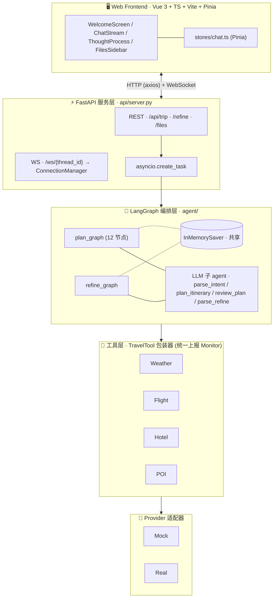
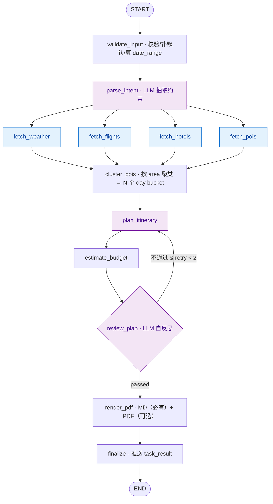
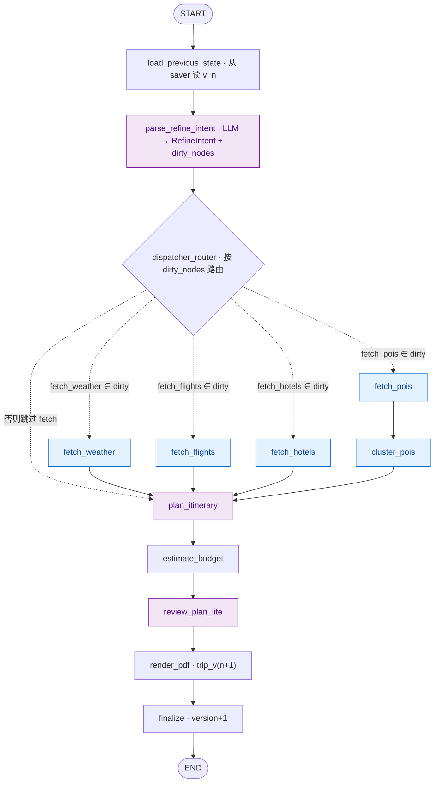
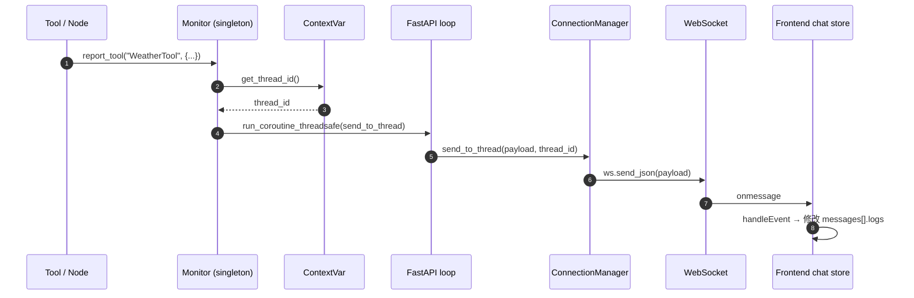
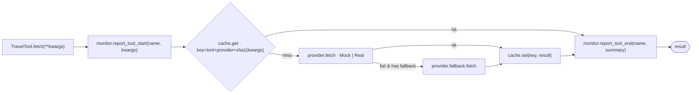
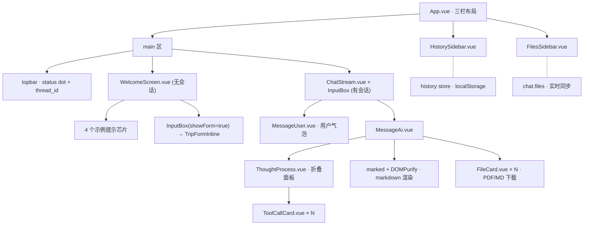

<div align="center">

# ✈️ TravelPlanningAgent

### 基于 LangGraph 多智能体协作的智能旅行规划助手

一句话或一张表单提交诉求，自动完成 **多源数据聚合 + 行程编排 + 自反思 + Markdown / PDF 报告生成**，<br/>
全程 WebSocket 实时推送 **节点 / 工具调用 / 思维链**，支持 **多轮调整** 与 **MOCK 零密钥运行**。

[](https://www.python.org/)
[](https://fastapi.tiangolo.com/)
[](https://langchain-ai.github.io/langgraph/)
[](https://vuejs.org/)
[](./LICENSE)

[English](./README.en.md) · **简体中文**

</div>

<p align="center">
  
  
</p>

---

## 目录

- [核心特性](#核心特性)
- [整体架构](#整体架构)
- [技术栈](#技术栈)
- [项目结构](#项目结构)
- [后端架构详解](#后端架构详解)
  - [LangGraph 工作流](#langgraph-工作流)
  - [TripState 状态设计](#tripstate-状态设计)
  - [跨协程实时推送 (ContextVar + Monitor)](#跨协程实时推送-contextvar--monitor)
  - [Checkpointer 与多轮调整](#checkpointer-与多轮调整)
  - [LLM 抽象层](#llm-抽象层)
  - [工具层 (Mock/Real 切换)](#工具层-mockreal-切换)
  - [PDF 渲染 (多引擎)](#pdf-渲染-多引擎)
- [前端架构详解](#前端架构详解)
  - [组件树](#组件树)
  - [Pinia 状态管理](#pinia-状态管理)
  - [WebSocket 客户端](#websocket-客户端)
- [端到端数据流](#端到端数据流)
- [快速开始](#快速开始)
- [配置项](#配置项)
- [API 参考](#api-参考)
- [WebSocket 事件协议](#websocket-事件协议)
- [冒烟测试](#冒烟测试)
- [演示行为说明](#演示行为说明)
- [License](#license)

---

## 核心特性

| # | 特性 | 说明 |
|---|------|------|
| F-01 | 多源信息聚合 | 并行调用天气 / 机票 / 酒店 / POI 工具 |
| F-02 | 智能行程编排 | 按片区聚类 + LLM 编排上午/中午/下午/晚上 4 时段 |
| F-03 | 主题适配 | 亲子 / 蜜月 / 美食 / 户外 / 文化等主题影响 POI 选择与节奏 |
| F-04 | 报告输出 | Markdown 始终生成；PDF 自动选择 Word COM / pandoc+xelatex / WeasyPrint |
| F-05 | 自反思循环 | `review_plan` 不通过会回到 `plan_itinerary`，最多 2 次 |
| F-06 | 失败降级 | 单个工具失败仅写入 `errors`，不阻塞主流程 |
| F-07 | 多轮调整 | `refine_graph` 按 `dirty_nodes` 最小化重算，`version+1` |
| F-08 | 异步执行 | `asyncio.create_task` 调度，HTTP 立即返回 |
| F-09 | Web 前端 | Vue 3 Kiro 风格：欢迎页 → 聊天流 + 思维链 + 文件抽屉 |
| F-10 | 实时推送 | 节点 / 工具 / 审稿迭代 / 任务结果通过 WebSocket 推送 |
| F-11 | 多用户隔离 | `ContextVar` 在协程级隔离 `session_dir` / `thread_id` |
| F-12 | Mock-to-Real | `USE_MOCK_TOOLS` / `MOCK_LLM` 一键切换数据源 |

---

## 整体架构



> **横切关注点 (Cross-cutting)**
> - `ContextVar(session_dir, thread_id)` —— 协程级会话隔离
> - `Monitor` 单例 + `run_coroutine_threadsafe` —— 任意深度反向推送 WS
> - `TTLCache (cachetools)` —— 工具结果缓存
> - `Jinja2` + `Word` / `Pandoc` / `WeasyPrint` —— 多引擎 PDF
> - 文件落盘：`output/session_{thread_id}/trip_v{N}.{md,pdf}`

---

## 技术栈

### 后端

| 类别 | 选型 | 说明 |
|------|------|------|
| 语言 | Python 3.11+ | |
| Agent 框架 | **LangGraph 1.0** + LangChain 1.0 | 状态机式工作流；`init_chat_model` 统一入口 |
| Web 框架 | FastAPI 0.115 + Uvicorn | 原生异步 / WebSocket / OpenAPI |
| Checkpointer | **InMemorySaver** | 进程内按 `thread_id` 隔离；可平滑切换到 Sqlite/Postgres |
| 异步调度 | `asyncio.create_task` | 不引入 Celery |
| 数据校验 | Pydantic v2 | 与 TripState 集成 |
| 实时通信 | 原生 WebSocket | 与前端 WebSocket API 直接对接 |
| 会话隔离 | `contextvars.ContextVar` | 协程级 |
| 缓存 | `cachetools.TTLCache` | 进程内，无 Redis 依赖 |
| 模板/PDF | Jinja2 + 多引擎(Word COM/pandoc/WeasyPrint) | 跨平台 Markdown→PDF |
| 日志 | Loguru | 彩色结构化输出 |

### 前端

| 类别 | 选型 | 说明 |
|------|------|------|
| 框架 | Vue 3.5 (Composition API + `<script setup>`) | |
| 语言 | TypeScript 5+ | 严格模式 |
| 构建 | Vite 5 | 代理 `/api` `/ws` → `127.0.0.1:8000` |
| 状态管理 | **Pinia** | `chat` / `history` 两个 store |
| HTTP | axios | REST 调用 |
| WebSocket | 原生 `WebSocket` + 自动重连 + 心跳 | 25s `ping` |
| Markdown | marked + DOMPurify | 渲染 AI 回复（XSS 防护） |
| 样式 | CSS Variables + Scoped CSS | Kiro 深色主题 |

---

## 项目结构

```
TravelPlanningAgent/
├── api/                         FastAPI 服务层
│   ├── server.py                  REST + WS 入口；asyncio.create_task 调度 agent
│   ├── connection_manager.py      WebSocket 连接管理（按 thread_id 路由）
│   ├── monitor.py                 ToolMonitor 单例，跨协程定向推送
│   ├── context.py                 ContextVar(session_dir, thread_id)
│   ├── schemas.py                 HTTP 请求/响应 Pydantic 模型
│   └── logger.py                  Loguru 配置
│
├── agent/                       LangGraph 编排层
│   ├── plan_agent.py              首次规划入口（设置 ContextVar、调度图）
│   ├── refine_agent.py            多轮调整入口
│   ├── plan_graph.py              build_plan_graph() — 12 节点状态机
│   ├── refine_graph.py            build_refine_graph() — 复用 plan 节点 + 派发器
│   ├── nodes.py                   12 个 plan-graph 节点（含 @_timed 装饰器）
│   ├── refine_nodes.py            load_previous_state / parse_refine_intent / dispatcher
│   ├── agents.py                  4 个 LLM 子 agent（独立 LLM 实例）
│   ├── llm.py                     MockLLM / RealLLM (init_chat_model)
│   ├── checkpointer.py            InMemorySaver 单例工厂
│   ├── load_prompts.py            YAML 提示词加载 + 安全 {var} 替换
│   └── state.py                   TripState (TypedDict + Annotated reducer)
│
├── tools/                       工具层
│   ├── base.py                    TravelTool 包装器（缓存 + monitor + 降级）
│   ├── factory.py                 provider 工厂（按 USE_MOCK_TOOLS 路由）
│   ├── cache.py                   TTLCache（key = tool+provider+sha1(kwargs)）
│   ├── providers/base.py          BaseProvider 抽象
│   └── mocks/                     mock_weather / mock_flight / mock_hotel / mock_poi
│       └── fixtures/poi/          东京/北京/大阪 离线 POI 数据
│
├── models/refine.py             RefineIntent + DIRTY_MAP（refine 类型 → 脏节点集合）
│
├── prompt/prompts.yaml          4 个集中式提示词模板
├── templates/trip_report.md     Jinja2 报告模板
│
├── services/pdf_renderer.py     Markdown 渲染 + 多引擎 PDF 转换
│
├── ui/                          Vue 3 前端
│   ├── src/
│   │   ├── App.vue                三栏布局：HistorySidebar / Main / FilesSidebar
│   │   ├── api/{http,trip,ws}.ts  axios + REST + WebSocket 客户端
│   │   ├── stores/chat.ts         Pinia 主 store（messages/threadId/status/files）
│   │   ├── stores/history.ts      历史会话（localStorage 持久化）
│   │   ├── components/            WelcomeScreen / ChatStream / MessageAi /
│   │   │                          ThoughtProcess / ToolCallCard / InputBox /
│   │   │                          TripFormInline / FileCard / 两个侧栏
│   │   └── types/{chat,ws,trip}.ts
│   └── vite.config.ts             /api /ws 代理到后端
│
├── scripts/
│   ├── smoke_test.py              直跑 plan + refine 图（无 HTTP）
│   ├── smoke_http.py              ASGI 端到端 + WS 管道测试
│   └── run_*.sh                   启动脚本
│
├── output/session_{thread_id}/  会话产物（trip_v{N}.md / .pdf）
├── DESIGN.md                    v0.3 完整设计文档（权威参考）
├── requirements.txt
├── pyproject.toml
└── README.md / README.en.md
```

---

## 后端架构详解

### LangGraph 工作流

#### Plan 图（`agent/plan_graph.py`）— 首次规划



**关键实现点**

- `@_timed(node_name)` 装饰器自动发 `node_start` / `node_end` 事件
- 节点返回 `{"_summary": "..."}` 字段会作为 `node_end` 的 `summary` 推到前端
- 4 个 fetcher 都是 `parse_intent` 的下游，LangGraph 自动并行
- `review_router` 条件边实现 review→retry 循环（最多 2 次）
- 异常仅 `monitor.report_error` + 记录到 `errors`，不中断主图

#### Refine 图（`agent/refine_graph.py`）— 多轮调整



`refine_intent.type` → `dirty_nodes` 映射在 `models/refine.py::DIRTY_MAP`：

| RefineType | dirty_nodes |
|------------|-------------|
| `swap_poi` / `rework_day` / `change_pace` / `freeform` | `{plan_itinerary}` |
| `change_hotel` | `{fetch_hotels, plan_itinerary}` |
| `change_flight` | `{fetch_flights}` |
| `change_theme` | `{fetch_pois, cluster_pois, plan_itinerary}` |
| `change_budget` | `{fetch_hotels, plan_itinerary}` |
| `extend_days` | 全部 fetch + cluster + plan |

> 所有 refine 类型都强制重算 `estimate_budget` → `review_plan_lite` → `render_pdf` → `finalize`，确保最终产物自洽。

### TripState 状态设计

`TripState` 是一个 `TypedDict`，用 `Annotated[..., reducer]` 声明 LangGraph 合并策略：

```python
class TripState(TypedDict, total=False):
    # 输入：destination / days_num / people_num / travel_theme / ...
    # 解析：parsed_intent / date_range / constraints
    # 聚合：weather / flights / hotels / pois / pois_clustered
    # 规划：itinerary / budget / tips / summary
    # 反思：review_passed / review_feedback / retry_count
    # 多轮：version / refine_request / refine_intent
    history:     Annotated[List[Dict], operator.add]   # 追加
    dirty_nodes: Annotated[set, _set_union]            # 集合合并
    files:       Annotated[List[Dict], operator.add]
    errors:      Annotated[List[Dict], operator.add]
```

并行节点同时写同一个键时通过 reducer 合并，无需手动同步。

### 跨协程实时推送 (ContextVar + Monitor)

后端的"任意深度都能把事件推到正确的前端连接"靠三件事：

1. **`api/context.py`** — `session_dir` / `thread_id` 用 `ContextVar` 存储；
   `run_plan_agent` 入口用 `set_session_context` / `set_thread_context` 写入，
   asyncio 任务及其衍生协程自然继承。
2. **`api/monitor.py::ToolMonitor`** — 进程级单例，
   工具/节点直接 `from api.monitor import monitor` 调用 `report_*`，
   它从 ContextVar 读 `thread_id`，再用
   `asyncio.run_coroutine_threadsafe(manager.send_to_thread(...), manager.loop)`
   把事件投递到 FastAPI 主事件循环。
3. **`api/connection_manager.py::ConnectionManager`** — 维护
   `Dict[thread_id → WebSocket]`，`send_to_thread` 选中目标连接发送。



**收益**：节点/工具是普通 `async def`，不需要持有 websocket 引用或参数透传，多用户并发安全。

### Checkpointer 与多轮调整

- `agent/checkpointer.py` 提供 `get_checkpointer() → InMemorySaver` 单例
- `plan_graph` 与 `refine_graph` **共用同一个 saver**
- 调用时 `config = {"configurable": {"thread_id": thread_id}}`，LangGraph 自动按 thread_id 加载/合并 checkpoint
- `refine_agent.run_refine_agent` 仅传 `{"refine_request": instruction}`，其余字段由 saver 合并恢复
- `load_previous_state` 通过 `saver.aget_tuple(config)` 读取 `version`，新版本号 `+1`

> ⚠️ **限制**：进程重启后 InMemorySaver 状态全部丢失。
> 升级路径：把 `get_checkpointer()` 切到 `SqliteSaver` / 自定义 PostgresSaver，
> 接口完全兼容，无需改业务代码。

### LLM 抽象层

`agent/llm.py` 提供两套实现 + 一个工厂：

| 类 | 触发条件 | 行为 |
|-----|----------|------|
| `MockLLM` | `MOCK_LLM=true`（默认）或缺 `OPENAI_API_KEY` | 按 prompt 关键词返回**结构化合规**的桩 JSON（4 种 prompt 各一种） |
| `RealLLM` | `MOCK_LLM=false` 且有 key | LangChain 1.0 `init_chat_model("gpt-4o", model_provider="openai", ...)` |

`agents.py` 中 4 个子 agent 各持有独立 LLM 实例，方便后续切不同模型：

| 子 agent | 调用节点 | 输入 → 输出 |
|---------|---------|------------|
| `parse_intent` | `parse_intent` | `bot_user_input` → `{parsed_intent, constraints}` |
| `plan_itinerary` | `plan_itinerary` | weather/pois_clustered/constraints → `{itinerary, tips}` |
| `review_plan` | `review_plan` | itinerary/weather/budget → `{passed, issues, suggestions}` |
| `parse_refine_intent` | `parse_refine_intent` | refine_request + 摘要 → `RefineIntent + dirty_nodes` |

`load_prompts.py` 用**手动 `{var}` 替换**而非 `str.format`，避免提示词中 JSON 大括号被误识别。

### 工具层 (Mock/Real 切换)



- `tools/factory.py` 按 `USE_MOCK_TOOLS` 选 provider；将来扩展时改路由表即可
- Mock provider 用 `hashlib.sha1(seed).hexdigest()` 做随机种子，**相同输入永远输出相同结果**（截图/测试友好）
- POI fixtures 已内置 **东京 / 北京 / 大阪**，其他城市走 Faker 合成

### PDF 渲染 (多引擎)

`services/pdf_renderer.py` 实现自动选择最优 PDF 引擎，端口自 DeepSearchResearcher：

| 平台 | 优先级 |
|------|--------|
| Windows | Word COM → pandoc(+xelatex) → WeasyPrint |
| macOS / Linux | pandoc(+xelatex) → WeasyPrint |

特别地：

- macOS 上自动把 `/Library/TeX/texbin`、`/opt/homebrew/bin` 等加入子进程 `PATH`，
  解决 GUI 启动的 Python（uvicorn / IDE）找不到 mactex 的常见问题
- 支持 `PDF_ENGINE=word|pandoc|weasyprint` 强制指定
- **Markdown 始终生成**；所有 PDF 引擎都失败时只产 `.md`，主流程不受影响

---

## 前端架构详解

### 组件树



### Pinia 状态管理

#### `stores/chat.ts` — 主 store

```typescript
state:
  messages : Message[]            // 用户/AI 消息（含 logs[] / files[]）
  threadId : string | null
  status   : 'idle'|'running'|'error'|'ok'
  files    : FileItem[]           // 右侧栏数据源

actions:
  startNewTrip(req, displayText)  // POST /api/trip + 建 WS + 推 history
  sendRefine(instruction)         // POST /api/trip/{tid}/refine
  selectThread(tid)               // 切换会话（重连 WS、清空消息、刷新文件）
  newSession()                    // 关 WS、清空、回欢迎页

私有:
  ensureWs(tid)                   // TripWS 单例（自动重连）
  handleEvent(msg)                // 路由所有 WS 事件 → 修改 messages
  patchLogTitle(kind, name, ...)  // 把同名 running 日志条目改为 done
```

事件 → 状态 映射规则（见 `handleEvent`）：

| WS 事件 | 行为 |
|---------|------|
| `session_created` | append 一条 info log "📁 会话目录已创建" |
| `tool_start` | append 一条 running 工具卡片 |
| `tool_end` | 把最近一条同名 running 卡片 patch 成 done + summary |
| `node_start` / `node_end` | 同上，但 kind=node |
| `review_iteration` | append review 卡片（passed → done，否则 error） |
| `partial_thought` | append 一条 info |
| `task_result` | 当前 AI 消息：`content = result; files = files; status = 'done'`；并刷新 `/api/files` |
| `error` | append error 卡片 + 标记当前 AI 消息为 error |

#### `stores/history.ts` — 历史会话

最多保留 50 条，按 `last_active` 倒序，持久化到 `localStorage` 的 `tpa.history.v1` 键。
`startNewTrip` 时 `upsert`，`refine` 不会改变历史顺序（thread_id 已存在）。

### WebSocket 客户端

`ui/src/api/ws.ts` 中的 `TripWS` 类提供：

- 自动 URL 解析：优先 `VITE_WS_BASE`，否则按页面 host + 协议（dev 模式由 Vite 反代）
- **重连**：`onclose` 后 1.5 秒重连，直到 `close()` 显式关闭
- **心跳**：每 25 秒发送 `"ping"` 字符串（后端会回 `{event:'pong'}`）
- 事件分发：`on(event, fn)` 订阅；`'*'` 监听所有事件
- 单例：`chat store::ensureWs(tid)` 保证同一 thread_id 复用同一连接

---

## 端到端数据流

### 首次规划

```mermaid
sequenceDiagram
    autonumber
    actor U as 用户
    participant FE as Frontend (chat store)
    participant API as FastAPI
    participant AG as plan_agent / plan_graph
    participant T as TravelTool
    participant LLM as LLM
    participant W as WebSocket

    U->>FE: 填表 + 输入诉求 → ➤
    FE->>API: POST /api/trip
    API-->>FE: {trip_id, thread_id, version:1}
    FE->>W: new WebSocket(/ws/{thread_id})
    API->>AG: asyncio.create_task(run_plan_agent)
    AG->>W: session_created
    AG->>AG: build_plan_graph().ainvoke(...)

    loop 每个节点
        AG->>W: node_start
        AG->>T: TravelTool.fetch
        T->>W: tool_start
        T->>T: provider.fetch (Mock / Real)
        T->>W: tool_end
        AG->>LLM: 调用 (Mock / GPT-4o)
        AG->>W: node_end
    end

    AG->>W: review_iteration (passed)
    AG->>AG: render_pdf → trip_v1.md / pdf
    AG->>W: task_result(version, files)
    W-->>FE: 推送
    FE->>FE: lastAi.content / files; status=ok
    FE->>API: GET /api/files?thread_id=...
```

> 期间，所有 `node_*` / `tool_*` / `review_*` 事件实时进入 `messages[lastAi].logs[]`，`ThoughtProcess` 组件自动显示在折叠面板中。

### 多轮调整

```mermaid
sequenceDiagram
    autonumber
    actor U as 用户
    participant FE as Frontend (chat store)
    participant API as FastAPI
    participant AG as refine_agent / refine_graph
    participant Sv as InMemorySaver
    participant LLM as LLM
    participant W as WebSocket

    U->>FE: 输入 "把第 3 天换成室内活动" → ➤
    FE->>API: POST /api/trip/{thread_id}/refine
    API->>AG: asyncio.create_task(run_refine_agent)

    AG->>Sv: aget_tuple(config) — 读 v_n
    Sv-->>AG: 上一版 state
    AG->>AG: version = v_n + 1

    AG->>LLM: parse_refine_intent
    LLM-->>AG: refine_intent + dirty_nodes={plan_itinerary}
    AG->>AG: dispatcher_router → ['plan_itinerary']

    AG->>AG: plan_itinerary → estimate_budget → review_plan_lite
    AG->>AG: render_pdf → trip_v(n+1).md / pdf
    AG->>W: task_result(version=n+1, files)
    W-->>FE: 推送
    FE->>FE: 新 AI 消息 content/files; FilesSidebar 多出 trip_v(n+1).pdf
```

---

## 快速开始

> 默认 MOCK 模式：**零密钥**即可端到端跑通。

### 1. 后端

```bash
pip install -r requirements.txt
PYTHONPATH=. python -m uvicorn api.server:app --reload --port 8000
```

### 2. 前端（新开终端）

```bash
cd ui && npm install && npm run dev
```

打开 **http://localhost:5173** 即可。

| 服务 | URL |
|------|-----|
| 前端 | http://localhost:5173 |
| 后端 | http://localhost:8000 |
| OpenAPI | http://localhost:8000/docs |
| WebSocket | `ws://localhost:8000/ws/{thread_id}` |

### 3. 不想跑前端？

仓库自带两个**无头冒烟脚本**完整跑通图 + WS 管道：

```bash
# 直跑 plan + refine（生成 trip_v1.md / trip_v2.md）
PYTHONPATH=. python scripts/smoke_test.py

# 端到端 HTTP + Monitor→WS 管道
PYTHONPATH=. python scripts/smoke_http.py
```

---

## 配置项

### 后端 `.env`

```env
# ===== LLM =====
MOCK_LLM=true                              # 默认；改为 false 启用真实模型
LLM_MODEL=gpt-4o
OPENAI_API_KEY=sk-...
# OPENAI_BASE_URL=https://your-proxy/v1   # 可选代理

# ===== 工具数据源 =====
USE_MOCK_TOOLS=true                        # 改为 false 走 Real Provider 路由

# ===== 服务 =====
HOST=0.0.0.0
PORT=8000
ALLOW_ORIGINS=http://localhost:5173,http://127.0.0.1:5173

# ===== PDF 引擎（可选）=====
# PDF_ENGINE=pandoc | weasyprint | word    # 不设则自动选择
```

### 前端 `ui/.env`

仅当前端不走 Vite 代理（独立部署）时才需要：

```env
VITE_API_BASE=http://localhost:8000
VITE_WS_BASE=ws://localhost:8000
```

### 启用真实 PDF（可选）

| 平台 | 命令 |
|------|------|
| macOS | `brew install pandoc && brew install --cask mactex` |
| Debian/Ubuntu | `sudo apt-get install -y pandoc texlive-xetex fonts-noto-cjk` |
| Windows | 安装 MS Office（Word COM 引擎自动可用），或 `pip install pywin32` |
| 任意系统 | `pip install weasyprint markdown`（轻量 fallback） |

不安装任何 PDF 引擎也能跑——只产出 Markdown。

---

## API 参考

### REST

| Method | Path | 说明 |
|--------|------|------|
| `GET`  | `/api/health` | 存活探针 |
| `POST` | `/api/trip` | 启动新规划 → `{trip_id, thread_id, status, version}` |
| `POST` | `/api/trip/{thread_id}/refine` | 提交调整指令 |
| `GET`  | `/api/trip/{thread_id}/versions` | 列出 MD/PDF 各版本 |
| `GET`  | `/api/files?thread_id=X` | 列出该会话目录下所有文件 |
| `GET`  | `/api/download?path=ABS` | 下载文件（路径限定在 `output/` 内） |
| `WS`   | `/ws/{thread_id}` | 服务端→客户端事件流 |

#### `POST /api/trip` 请求体

```jsonc
{
  "conversation_name": "trip_2026_summer",   // 可选，作为 thread_id；缺省自动生成
  "bot_user_input":    "想带 3 岁小孩，避免长途车程",
  "destination":       "大阪",                // 必填
  "departure":         "上海",
  "days_num":          5,                     // 必填 (1~30)
  "people_num":        2,                     // 必填 (1~20)
  "start_date":        "2026-07-15",
  "travel_theme":      "亲子"
}
```

---

## WebSocket 事件协议

客户端连上 `/ws/{thread_id}` 后，**只发送** `"ping"` 字符串作为 25s 心跳；
服务端回包格式统一为 `{ "event": <name>, "data": {...} }`：

| event | 时机 | data |
|-------|------|------|
| `session_created` | agent 入口设置 ContextVar 后 | `{ path }` |
| `node_start` | 每个 LangGraph 节点进入 | `{ node, ts }` |
| `node_end` | 节点结束 | `{ node, duration_ms, summary? }` |
| `tool_start` | TravelTool.fetch 入口 | `{ tool_name, args }` |
| `tool_end` | TravelTool.fetch 完成 | `{ tool_name, summary? }` |
| `review_iteration` | review_plan 每次结果 | `{ iteration, passed, feedback? }` |
| `partial_thought` | 节点中间思考（预留） | `{ text }` |
| `task_result` | finalize 完成 | `{ result, version, files[] }` |
| `error` | 任意层级 try/except | `{ where?, message }` |
| `pong` | 服务端心跳响应 | `{}` |

---

## 冒烟测试

每次后端改动后，两个脚本必须保持绿：

```text
scripts/smoke_test.py    plan + refine 各产出 trip_v1.md / trip_v2.md
scripts/smoke_http.py    /api/health + /api/trip + /api/files + /api/.../refine
                         + Monitor→WS 管道（验证 session_created / node_start×12 /
                            node_end×12 / tool_start×5 / tool_end×5 /
                            review_iteration / task_result）
```

---

## 演示行为说明

1. **InMemorySaver** 在进程内按 `thread_id` 隔离 State；
   后端重启后历史会话失效（前端 localStorage 仍记录，但新指令会触发全新规划）。
2. **MOCK_LLM** 对 4 类 prompt 都返回结构合规的桩 JSON，离线即可全图跑通。
3. **Mock 工具**输出由输入哈希做种子，**完全确定性**，便于截图与冒烟。
4. POI fixtures 自带 **东京 / 北京 / 大阪**；其他城市走 Faker 合成池。
5. 单个 fetcher 失败仅写入 `state.errors`，**不阻塞整体行程生成**。
6. PDF 引擎一个都不可用时，只输出 Markdown，前端 `FileCard` 仍可下载。

---

## License

MIT — 仅作 Demo。生产化指南详见 [DESIGN.md §12](./DESIGN.md)。
